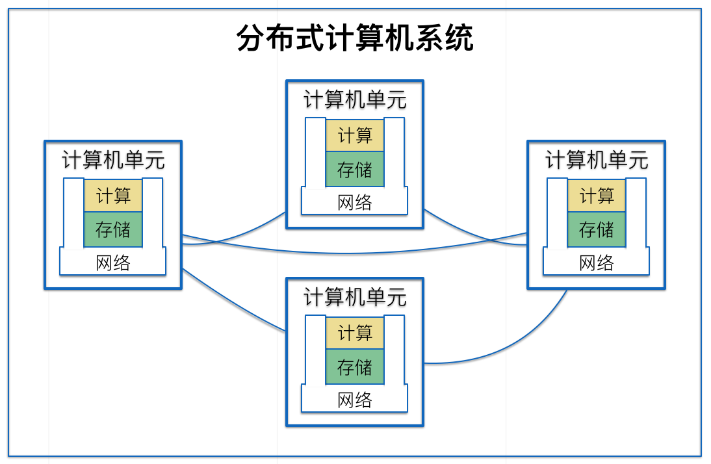

# 区块链技术思考

## 前言
对于区块链技术，业界有很多不同的看法，大多数认为比特币是区块链的起点，从比特币开始说明区块链。显然，比特币是区块链技术的代表，但并不能代表区块链技术。
在此文中，我将从计算机技术角度来阐述区块链技术。首先将计算机技术做一个整体的抽象说明，旨在为后文阐述的统一概念。
其后，将从计算机技术中的计算、存储、网络三个维度分别阐述区块链技术的本质，以帮助你理解区块链技术。
最后，将给出区块链技术的总结。
希望通过本文件，你能深刻理解区块链技术是什么，以及它适用于哪些场景。

## 计算机系统抽象说明

对于普通的计算机，相信大家都很熟悉，就是我们常说的”电脑”（但要记住，计算机的含义要比现在我们看到的电脑要广得多）。计算机有很多组成部分，但为了我们后文的讨论方便，这里仅将单台计算机看成由三个关键部分, 如下图所示：

* 存储: 对数据进行执久化存储的硬件及软件。
* 计算：对原始输入数据进行处理，输出新数据的硬件及软件。
* 网络：将单个计算单元进行互连互通的硬件及软件。

这里单台计算机，我又称为计算机单元。将各个独立的计算机单元通过网络连接在一起，就形成了一个分布式计算机系统。
接下来，我将分别从这三个维度讲解区块链技术。

## 存储

## 计算

## 网络

## DApp 应用

## 总结
